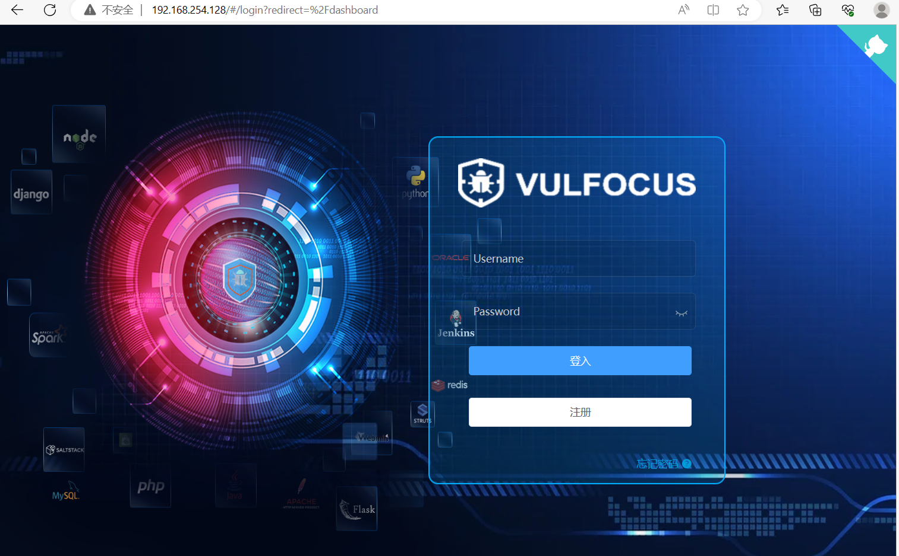

# REPORT

Ani
---

- [负责工作](#负责工作)
- [实验目的](#实验目的)
- [实验环境](#实验环境)
- [实验过程](#实验过程)
    - [学习相关课程和资料](#学习相关课程和资料)
    - [从零开始搭建基础虚拟机环境](#从零开始搭建基础虚拟机环境)
    - [布置攻防训练环境](#把攻防训练环境从仓库中拉取到虚拟机系统中)
    - [测试部署本地的 Vulfocus](#测试部署本地的-vulfocus)
    - [自定义场景拓扑镜像](#自定义场景拓扑镜像)
- [参考资料](#参考资料)

---

### 负责工作

- 作为红队完成对漏洞的存在性检验以及实现漏洞利用
- 作为蓝队完成漏洞利用的缓解
- 实现自动化脚本

### 实验目的

完成 **基础团队实践训练** ：开源信息系统搭建、加固与漏洞攻防

团队分工跟练复现完成 [网络安全(2021) 综合实验](http://courses.cuc.edu.cn/course/109860/learning-activity/full-screen#/554139) 。无论团队由多少人所组成，以下按本次实践训练所涉及到的人员能力集合划分了以下团队角色。一人至少承担一种团队角色，老师将按照该角色的评价标准进行 基于客观事实的主观评价 

- 红队：需完成漏洞存在性验证和漏洞利用

- 蓝队威胁监测：漏洞利用的持续检测和威胁识别与报告

- 蓝队威胁处置：漏洞利用的缓解和漏洞修复（源代码级别和二进制级别两种）

上述能力的基本评分原则参考 “道术器” 原则：最基础要求是能够跟练并复现 [网络安全(2021) 综合实验](http://courses.cuc.edu.cn/course/109860/learning-activity/full-screen#/554139) 中演示实验使用到的工具；进阶标准是能够使用课程视频中 **未使用** 的工具或使用编程自动化、甚至是智能化的方式完成漏洞攻击或漏洞利用行为识别与处置

### 实验环境

`VMware`

`Kali 2023.2`

### 实验过程

#### 从零开始搭建基础虚拟机环境

之前电脑出了问题，将整个电脑都重置了，所以从零开始

先安装需要的环境如 `Vmware` 虚拟机、 `Kali` 镜像等

将下载好的 `Kali` 导入 `VMware` 虚拟机，并配置好两块网卡：网络地址转换 (`NAT`) 以及 仅主机 (`Host-Only`) 网络


其中第一块网卡负责让虚拟机能联网，而第二块网卡用于方便本地连接虚拟机

启动虚拟机，在终端查看网卡状态：

```bash
ip a
```


可见虚拟机已经为两块网卡都分配好了地址，不需要我们手动配置

宿主机 `ssh` 连接虚拟机

```bash
ssh kali@192.168.254.128
```

出现如下报错：


到 `Kali` 中设置开机自启动并手动启动服务

```bash
sudo systemctl enable ssh
sudo systemctl start ssh
```


检查进程：

```bash
ps aux|grep ssh
```


可见守护进程 `sshd` 已启动

还是连接失败，一直显示密码不对，然后发现连接命令写错了，是小写 `k` 不是大写 `K`

连接成功：


配置免密登录

使用命令复制公钥到虚拟机

```bash
ssh-copy id -i C:\Users\86133\.ssh\id_rsa.pub kali@192.168.254.128
```


显示如上问题，于是换了别的命令完成：

```bash
scp C:\Users\86133\.ssh\id_rsa.pub kali@192.168.254.128:/home/kali/tty
```


将公钥传入 `authorized_keys` 中

```bash
cat id_rsa.pub >> ../.ssh/authorized_keys
```

报错如下：


查看一下 `~` 目录下所有的文件夹和文件


发现没有 `.ssh` 文件夹

执行 `ssh localhost`


再次查看出现 `.ssh` 文件夹


现在可以成功传入公钥


实现免密登录


### 把攻防训练环境从仓库中拉取到虚拟机系统中

在模拟红蓝网络攻防实践的整个过程之前，需要完成本地环境的部署，使用老师提供的 [简易教程](https://github.com/c4pr1c3/ctf-games/tree/master/fofapro/vulfocus) 进行搭建：

```bash
git clone https://github.com/c4pr1c3/ctf-games.git
```

出现网络连接的问题


`ping` 一下发现是可以通的，再次尝试就连上了。这是因为解析 `github` 的域名解析到了不同的 `ip`，刚好第二次解析到一个可用的 `ip` ，他就可以了


通过使用 `Docker Compose` 来构造 `docker` 环境，其中 `git` 克隆下来的仓库中包含老师已经配置好的对应的 `.yml` 文件，直接执行即可构建对应的环境：

```bash
sudo apt update && sudo apt install -y docker.io docker-compose jq
```


将当前用户添加到 `docker` 用户组，免 `sudo` 执行 `docker` 相关指令：

```bash
$ sudo usermod -a -G docker ${USER}
```

重新登录 `shell` 生效

切换到 root 用户权限下执行：

更换 `docker` 镜像源，使用中科大 `Docker Hub` 镜像源：

```bash
cat <<EOF > /etc/docker/daemon.json
{
  "registry-mirrors": ["https://docker.mirrors.ustc.edu.cn/"]
}
EOF
```
重启 `docker` 服务使配置生效

```bash
systemctl daemon-reload
systemctl restart docker.service
```


提前拉取 `vulfocus` 镜像

```bash
docker pull vulfocus/vulfocus：latest
```

发现超级超级慢！查询资料发现由于访问原始站点的网络带宽等条件的限制，导致 `Docker Hub`,` Google Container Registry (gcr.io)` 与 `Quay Container Registry (quay.io)` 的镜像缓存处于基本不可用的状态，因此科大镜像站的各容器镜像服务仅限校内使用。当然也可能是我家的网实在是太慢了...

于是更换成以下源：

```bash
https://hub-mirror.c.163.com/
https://3cnn2icv.mirror.aliyuncs.com
```


拉取成功：


发现一件很搞笑的事情...配置了免密登录但是忘记这回事，前面都直接在虚拟机上操作

运行老师提供的脚本，并选择其推荐的支持对外访问 `vulfocus-web` 的 `ip`，这里推荐的是 `host-only` 网卡所分配到的地址

```bash
bash start.sh
```


这样 `docker` 镜像就可以跑起来了，在宿主机访问这个地址即可进入到 `vulfocus` 的页面：



### 测试部署本地的 Vulfocus

使用账号密码（这里均为 `admin`）登录后，选择 `镜像管理 -- 镜像管理 -- 一键同步` ，获取 `Vulfocus` 提供的镜像：


搜索需要的镜像并下载


下载完成后可在首页启动并测试环境


### 漏洞的存在性检验 （CVE-2021-44228）

#### 漏洞介绍

`log4j2` 是 `apache` 下的 `java` 应用常见的开源日志库，是一个就 `Java` 的日志记录工具。在 `log4j` 框架的基础上进行了改进，并引入了丰富的特性，可以控制日志信息输送的目的地为控制台、文件、`GUI` 组建等，被应用于业务系统开发，用于记录程序输入输出日志信息

#### 找到靶标的访问入口

修改镜像启动时间，启动靶机并访问 `http://192.168.254.128:50175/`


点击 `？？？？` 有：


#### 检测漏洞存在性

查看容器相关信息

```bash
docker ps
```


得容器名为 `adoring_bhabha`

进入容器找到 `jar` 文件

```bash
docker exec -it adoring_bhabha bash
```


将 `jar` 文件复制到虚拟机上

```bash
sudo docker cp adoring_bhabha:/demo/demo.jar ./
```


在虚拟机中下载反编译软件 ``

用反编译软件打开 `jar` 文件，可以看到存在漏洞代码


#### 验证漏洞可利用性


#### 漏洞利用效果


### 参考资料

[网络安全 2021 综合实验](https://www.bilibili.com/video/BV1p3411x7da?p=4&spm_id_from=pageDriver&vd_source=c77148c25420ef65a1b98a765a8e118c)

[课件](https://c4pr1c3.github.io/cuc-ns-ppt/vuls-awd.md.v4.html)

[VMware 双网卡配置](https://blog.csdn.net/qiu_zhi_liao/article/details/81268073)

[本地免密登录](https://blog.csdn.net/Weary_PJ/article/details/104561720)

[Docker Hub 源使用帮助](https://mirrors.ustc.edu.cn/help/dockerhub.html)

[log4j2 官网介绍](https://logging.apache.org/log4j/2.x/index.html)

[Docker-docke 服务启动报错：Job for docker.service failed because the control process exited with error code.](https://blog.csdn.net/MinggeQingchun/article/details/123344229)

[docker 启动报错：Failed to start Docker Application Container Engine](https://blog.csdn.net/u010918487/article/details/106925282)

---

