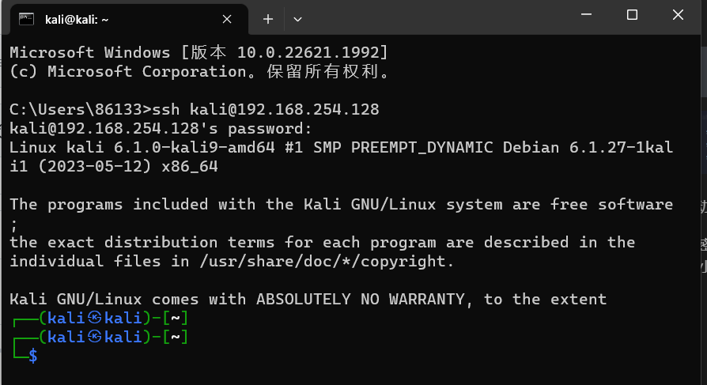
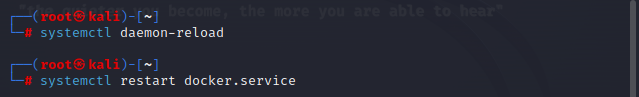

# REPORT

Ani
---

[TOC]
- [负责工作](#负责工作)
- [实验目的](#实验目的)
- [实验环境](#实验环境)
- [实验过程](#实验过程)
    - [从零开始搭建基础虚拟机环境](#从零开始搭建基础虚拟机环境)
- [参考资料](#参考资料)

---

### 负责工作


### 实验目的

完成 **基础团队实践训练** ：开源信息系统搭建、加固与漏洞攻防

团队分工跟练复现完成 [网络安全(2021) 综合实验](http://courses.cuc.edu.cn/course/109860/learning-activity/full-screen#/554139) 。无论团队由多少人所组成，以下按本次实践训练所涉及到的人员能力集合划分了以下团队角色。一人至少承担一种团队角色，老师将按照该角色的评价标准进行 基于客观事实的主观评价 

- 红队：需完成漏洞存在性验证和漏洞利用

- 蓝队威胁监测：漏洞利用的持续检测和威胁识别与报告

- 蓝队威胁处置：漏洞利用的缓解和漏洞修复（源代码级别和二进制级别两种）

上述能力的基本评分原则参考 “道术器” 原则：最基础要求是能够跟练并复现 [网络安全(2021) 综合实验](http://courses.cuc.edu.cn/course/109860/learning-activity/full-screen#/554139) 中演示实验使用到的工具；进阶标准是能够使用课程视频中 **未使用** 的工具或使用编程自动化、甚至是智能化的方式完成漏洞攻击或漏洞利用行为识别与处置

### 实验环境

`VMware`

`Kali 2023.2`

### 实验过程

#### 从零开始搭建基础虚拟机环境

之前电脑出了问题，将整个电脑都重置了，所以从零开始

先安装需要的环境如 `Vmware` 虚拟机、 `Kali` 镜像等

将下载好的 `Kali` 导入 `VMware` 虚拟机，并配置好两块网卡：网络地址转换 (`NAT`) 以及 仅主机 (`Host-Only`) 网络


其中第一块网卡负责让虚拟机能联网，而第二块网卡用于方便本地连接虚拟机

启动虚拟机，在终端查看网卡状态：

```bash
ip a
```


可见虚拟机已经为两块网卡都分配好了地址，不需要我们手动配置

宿主机 `ssh` 连接虚拟机

```bash
ssh kali@192.168.254.128
```

出现如下报错：


到 `Kali` 中设置开机自启动并手动启动服务

```bash
sudo systemctl enable ssh
sudo systemctl start ssh
```


检查进程：

```bash
ps aux|grep ssh
```


可见守护进程 `sshd` 已启动

还是连接失败，一直显示密码不对，然后发现连接命令写错了，是小写 `k` 不是大写 `K`

连接成功：



配置免密登录

使用命令复制公钥到虚拟机

```bash
ssh-copy id -i C:\Users\86133\.ssh\id_rsa.pub kali@192.168.254.128
```


显示如上问题，于是换了别的命令完成：

```bash
scp C:\Users\86133\.ssh\id_rsa.pub kali@192.168.254.128:/home/kali/tty
```


将公钥传入 `authorized_keys` 中

```bash
cat id_rsa.pub >> ../.ssh/authorized_keys
```

报错如下：


查看一下 `~` 目录下所有的文件夹和文件


发现没有 `.ssh` 文件夹

执行 `ssh localhost`


再次查看出现 `.ssh` 文件夹


现在可以成功传入公钥


实现免密登录


### 把攻防训练环境从仓库中拉取到虚拟机系统中

在模拟红蓝网络攻防实践的整个过程之前，需要完成本地环境的部署，使用老师提供的 [简易教程](https://github.com/c4pr1c3/ctf-games/tree/master/fofapro/vulfocus) 进行搭建：

```bash
git clone https://github.com/c4pr1c3/ctf-games.git
```

出现网络连接的问题


`ping` 一下发现是可以通的，再次尝试就连上了。这是因为解析 `github` 的域名解析到了不同的 `ip`，刚好第二次解析到一个可用的 `ip` ，他就可以了


通过使用 `Docker Compose` 来构造 `docker` 环境，其中 `git` 克隆下来的仓库中包含老师已经配置好的对应的 `.yml` 文件，直接执行即可构建对应的环境：

```bash
sudo apt update && sudo apt install -y docker.io docker-compose jq
```


将当前用户添加到 `docker` 用户组，免 `sudo` 执行 `docker` 相关指令：

```bash
$ sudo usermod -a -G docker ${USER}
```

重新登录 `shell` 生效

切换到 root 用户权限下执行

更换 `docker` 镜像源：

```bash
cat <<EOF > /etc/docker/daemon.json
{
  "registry-mirrors": ["https://docker.mirrors.ustc.edu.cn/","https://registry.docker-cn.com",
    "http://hub-mirror.c.163.com",
    "https://docker.mirrors.ustc.edu.cn",
    "https://cr.console.aliyun.com",
    "https://mirror.ccs.tencentyun.com"]
}
EOF
```
重启 `docker` 服务使配置生效



提前拉取 `vulfocus` 镜像

```bash
docker pull vulfocus/vulfocus：latest
```


### 参考资料

[网络安全2021综合实验](https://www.bilibili.com/video/BV1p3411x7da?p=4&spm_id_from=pageDriver&vd_source=c77148c25420ef65a1b98a765a8e118c)

[VMware双网卡配置](https://blog.csdn.net/qiu_zhi_liao/article/details/81268073)

[本地免密登录](https://blog.csdn.net/Weary_PJ/article/details/104561720)